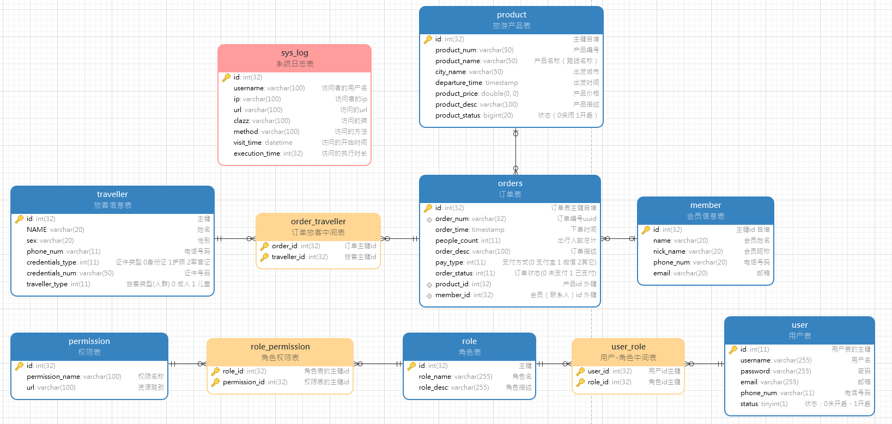
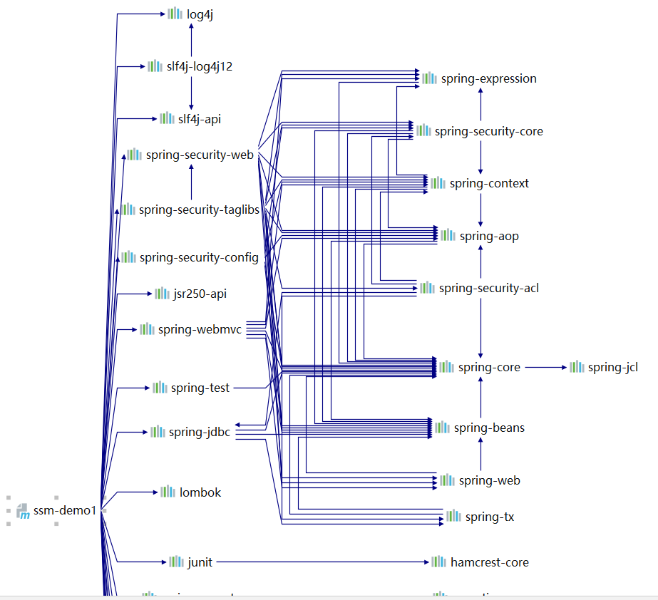
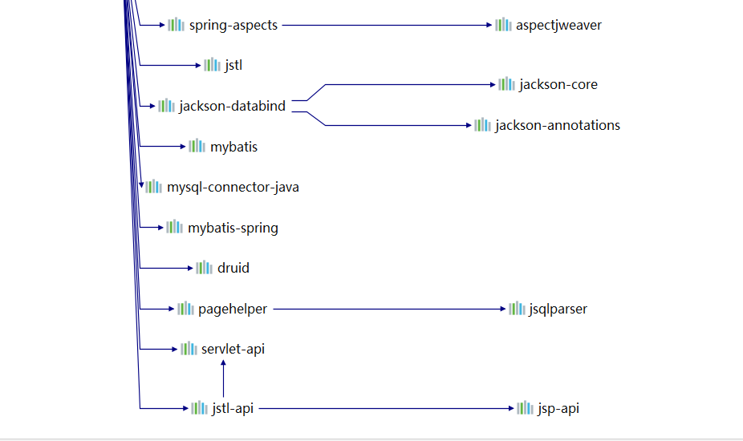

# SSM 综合案例——企业权限管理系统

## 1. 功能模块

## 2. 数据库关系图



数据库文件：config/db.sql

## 3. 技术点





```xml
<?xml version="1.0" encoding="UTF-8"?>
<project xmlns="http://maven.apache.org/POM/4.0.0"
         xmlns:xsi="http://www.w3.org/2001/XMLSchema-instance"
         xsi:schemaLocation="http://maven.apache.org/POM/4.0.0 http://maven.apache.org/xsd/maven-4.0.0.xsd">
    <modelVersion>4.0.0</modelVersion>

    <groupId>cn.yhs.learn</groupId>
    <artifactId>ssm-demo1</artifactId>
    <packaging>pom</packaging>
    <version>1.0-SNAPSHOT</version>
    <modules>
        <module>ssm-demo1-web</module>
        <module>ssm-demo2</module>
    </modules>
    <!--将SSM整合的进行拆分。这是一个父工程-->
    <properties>
        <!--spring相关的版本的版本-->
        <spring-context.version>5.0.10.RELEASE</spring-context.version>
        <!--spring-security版本-->
        <spring-security.version>5.0.9.RELEASE</spring-security.version>
        <!--spring整合mybatis的版本-->
        <mybatis-spring.version>1.3.2</mybatis-spring.version>
        <!--spring整合junit的版本-->
        <spring-junit.version>5.0.8.RELEASE</spring-junit.version>
        <!--servlet-->
        <servlet.version>2.5</servlet.version>
        <servlet-jsp.version>2.0</servlet-jsp.version>
        <!--数据层版本-->
        <mybatis.version>3.4.5</mybatis.version>
        <pagehelper.version>5.1.10</pagehelper.version>
        <druid.version>1.1.12</druid.version>
        <mysql.version>5.1.47</mysql.version>
        <!--工具层版本-->
        <jackson.version>2.9.8</jackson.version>
        <lombok.version>1.18.8</lombok.version>
        <slf4j.version>1.6.6</slf4j.version>
        <log4j.version>1.2.17</log4j.version>
        <junit.version>4.12</junit.version>
    </properties>
    <dependencyManagement>
        <dependencies>
            <!--解决版本之间的依赖冲突-->
            <dependency>
                <groupId>org.springframework</groupId>
                <artifactId>spring-core</artifactId>
                <version>5.0.8.RELEASE</version>
            </dependency>
        </dependencies>
    </dependencyManagement>

    <dependencies>
        <!--=============================== Web层 ================================-->
        <!--SpringSecurity版本-->
        <dependency>
            <groupId>org.springframework.security</groupId>
            <artifactId>spring-security-web</artifactId>
            <version>${spring-security.version}</version>
        </dependency>
        <dependency>
            <groupId>org.springframework.security</groupId>
            <artifactId>spring-security-config</artifactId>
            <version>${spring-security.version}</version>
        </dependency>
        <!--权限控制——页面级别的控制-->
        <dependency>
            <groupId>org.springframework.security</groupId>
            <artifactId>spring-security-taglibs</artifactId>
            <version>${spring-security.version}</version>
        </dependency>
        <!--JSR250-->
        <!--方法级别的权限控制1.导入依赖-->
        <dependency>
            <groupId>javax.annotation</groupId>
            <artifactId>jsr250-api</artifactId>
            <version>1.0</version>
        </dependency>
        <dependency>
            <groupId>org.springframework</groupId>
            <artifactId>spring-webmvc</artifactId>
            <version>${spring-context.version}</version>
        </dependency>
        <!--导入servlet-->
        <dependency>
            <groupId>javax.servlet</groupId>
            <artifactId>servlet-api</artifactId>
            <version>${servlet.version}</version>
            <scope>provided</scope>
        </dependency>
        <!-- https://mvnrepository.com/artifact/javax.servlet/jstl -->
        <dependency>
            <groupId>javax.servlet</groupId>
            <artifactId>jstl</artifactId>
            <version>1.2</version>
        </dependency>
        <!-- https://mvnrepository.com/artifact/javax.servlet.jsp.jstl/jstl-api -->
        <dependency>
            <groupId>javax.servlet.jsp.jstl</groupId>
            <artifactId>jstl-api</artifactId>
            <version>1.2</version>
        </dependency>


        <!--=============================== SERVICE层 ================================-->
        <!--spring,自动会导入底层依赖的spring包-->
        <!--        <dependency>
                    <groupId>org.springframework</groupId>
                    <artifactId>spring-context</artifactId>
                    <version>${spring-context.version}</version>
                </dependency>-->
        <!--spring 面向切面编程必须加的jar-->
        <dependency>
            <groupId>org.springframework</groupId>
            <artifactId>spring-aspects</artifactId>
            <version>${spring-context.version}</version>
        </dependency>
        <!--spring 事务-->
        <!--       <dependency>
                   <groupId>org.springframework</groupId>
                   <artifactId>spring-tx</artifactId>
                   <version>${spring-context.version}</version>
               </dependency>-->
        <!--spring 事务管理数据源-->
        <dependency>
            <groupId>org.springframework</groupId>
            <artifactId>spring-jdbc</artifactId>
            <version>${spring-context.version}</version>
        </dependency>

        <!--=============================== spring整合mybatis的jar ================================-->
        <!-- https://mvnrepository.com/artifact/org.mybatis/mybatis-spring -->
        <dependency>
            <groupId>org.mybatis</groupId>
            <artifactId>mybatis-spring</artifactId>
            <version>${mybatis-spring.version}</version>
        </dependency>
        <!--=============================== spring整合junit的jar ================================-->
        <dependency>
            <groupId>org.springframework</groupId>
            <artifactId>spring-test</artifactId>
            <version>${spring-junit.version}</version>
            <!--  <scope>test</scope>-->
        </dependency>

        <!--=============================== DAO层 ================================-->
        <!--mybatis版本-->
        <dependency>
            <groupId>org.mybatis</groupId>
            <artifactId>mybatis</artifactId>
            <version>${mybatis.version}</version>
        </dependency>
        <!-- 分页插件版本 -->
        <dependency>
            <groupId>com.github.pagehelper</groupId>
            <artifactId>pagehelper</artifactId>
            <version>${pagehelper.version}</version>
        </dependency>

        <!--数据库连接池-->
        <dependency>
            <groupId>com.alibaba</groupId>
            <artifactId>druid</artifactId>
            <version>${druid.version}</version>
        </dependency>
        <!--mysql版本-->
        <dependency>
            <groupId>mysql</groupId>
            <artifactId>mysql-connector-java</artifactId>
            <version>${mysql.version}</version>
        </dependency>

        <!--=============================== 工具层 ================================-->
        <!-- https://mvnrepository.com/artifact/com.fasterxml.jackson.core/jackson-databind -->
        <dependency>
            <groupId>com.fasterxml.jackson.core</groupId>
            <artifactId>jackson-databind</artifactId>
            <version>${jackson.version}</version>
        </dependency>
        <dependency>
            <groupId>org.projectlombok</groupId>
            <artifactId>lombok</artifactId>
            <version>${lombok.version}</version>
            <scope>provided</scope>
        </dependency>
        <dependency>
            <groupId>log4j</groupId>
            <artifactId>log4j</artifactId>
            <version>${log4j.version}</version>
        </dependency>
        <dependency>
            <groupId>org.slf4j</groupId>
            <artifactId>slf4j-api</artifactId>
            <version>${slf4j.version}</version>
        </dependency>
        <dependency>
            <groupId>org.slf4j</groupId>
            <artifactId>slf4j-log4j12</artifactId>
            <version>${slf4j.version}</version>
        </dependency>
        <dependency>
            <groupId>junit</groupId>
            <artifactId>junit</artifactId>
            <version>${junit.version}</version>
        </dependency>


    </dependencies>
    <build>
        <pluginManagement>
            <plugins>
                <plugin>
                    <groupId>org.apache.maven.plugins</groupId>
                    <artifactId>maven-compiler-plugin</artifactId>
                    <version>3.2</version>
                    <configuration>
                        <source>1.8</source>
                        <target>1.8</target>
                        <encoding>UTF-8</encoding>
                        <showWarnings>true</showWarnings>
                    </configuration>
                </plugin>

            </plugins>
        </pluginManagement>
    </build>

</project>
```

## 4. 主要配置文件

### 4.1 spring配置文件

```xml
<?xml version="1.0" encoding="UTF-8"?>
<beans xmlns="http://www.springframework.org/schema/beans"
       xmlns:xsi="http://www.w3.org/2001/XMLSchema-instance"
       xmlns:context="http://www.springframework.org/schema/context" xmlns:tx="http://www.springframework.org/schema/tx"
       xmlns:aop="http://www.springframework.org/schema/aop"
       xsi:schemaLocation="http://www.springframework.org/schema/beans http://www.springframework.org/schema/beans/spring-beans.xsd http://www.springframework.org/schema/context http://www.springframework.org/schema/context/spring-context.xsd http://www.springframework.org/schema/tx http://www.springframework.org/schema/tx/spring-tx.xsd http://www.springframework.org/schema/aop http://www.springframework.org/schema/aop/spring-aop.xsd">
    <!--Spring的配置文件-->
    <!--1. 配置基本包的扫描，排除@Controller注解的层-->
    <context:component-scan base-package="cn.yhs.learn">
        <context:exclude-filter type="annotation" expression="org.springframework.stereotype.Controller"/>
    </context:component-scan>

    <!--2. 配置Druid数据源-->
    <context:property-placeholder location="classpath:jdbc.properties"/>
    <bean class="com.alibaba.druid.pool.DruidDataSource" id="dataSource">
        <property name="driverClassName" value="${druid.jdbc.driverClassName}"/>
        <property name="url" value="${druid.jdbc.url}"/>
        <property name="username" value="${druid.jdbc.username}"/>
        <property name="password" value="${druid.jdbc.password}"/>
        <property name="initialSize" value="${druid.jdbc.initialSize}"/>
        <property name="maxActive" value="${druid.jdbc.maxActive}"/>
        <property name="maxWait" value="${druid.jdbc.maxWait}"/>
    </bean>
    <!--================service层 开始==================-->
    <!--3. 配置事务管理器-->
    <bean class="org.springframework.jdbc.datasource.DataSourceTransactionManager" id="transactionManager">
        <property name="dataSource" ref="dataSource"/>
    </bean>

    <!--4. 配置声明式事务，service事务异常回滚-->
    <tx:advice id="txAdvice" transaction-manager="transactionManager">
        <tx:attributes>
            <tx:method name="find*" read-only="true"/>
            <tx:method name="*" read-only="false"/>
        </tx:attributes>
    </tx:advice>
    <aop:config>
        <aop:pointcut id="pt1" expression="execution(* cn.yhs.learn.service.*.*(..))"/>
        <aop:advisor advice-ref="txAdvice" pointcut-ref="pt1"/>
    </aop:config>
    <!--================service层 结束==================-->
    <!--================dao层 开始==================-->

    <!--5. 配置sqlSessionFactoryBean-->
    <bean class="org.mybatis.spring.SqlSessionFactoryBean" id="sessionFactoryBean">
        <!--5.1 配置数据源-->
        <property name="dataSource" ref="dataSource"/>
        <!--5.2 配置分页插件-->
        <property name="plugins">
            <array>
                <bean class="com.github.pagehelper.PageInterceptor" id="pageInterceptor">
                    <property name="properties">
                        <value>
                            helperDialect=mysql
                            reasonable=true
                        </value>
                    </property>
                </bean>
            </array>
        </property>
    </bean>

    <!--6. 配置mapper扫描-->
    <bean class="org.mybatis.spring.mapper.MapperScannerConfigurer" id="mapperScannerConfigurer">
        <property name="basePackage" value="cn.yhs.learn.dao"/>
    </bean>

    <!--================dao层 结束==================-->


</beans>
```

### 4.2 spring-mvc配置文件

```xml
<?xml version="1.0" encoding="UTF-8"?>
<beans xmlns="http://www.springframework.org/schema/beans"
       xmlns:xsi="http://www.w3.org/2001/XMLSchema-instance"
       xmlns:context="http://www.springframework.org/schema/context"
       xmlns:mvc="http://www.springframework.org/schema/mvc"
       xsi:schemaLocation="http://www.springframework.org/schema/beans http://www.springframework.org/schema/beans/spring-beans.xsd http://www.springframework.org/schema/context http://www.springframework.org/schema/context/spring-context.xsd http://www.springframework.org/schema/mvc http://www.springframework.org/schema/mvc/spring-mvc.xsd">
    <!--Spring-MVC配置文件-->
    <!--1. 配置基本包扫描，只扫描带有@Controller -->
    <context:component-scan base-package="cn.yhs.learn">
        <context:include-filter type="annotation" expression="org.springframework.stereotype.Controller"/>
    </context:component-scan>

    <!--2.配置视图解析器-->
    <bean class="org.springframework.web.servlet.view.InternalResourceViewResolver" id="viewResolver">
        <property name="prefix" value="/pages/"/>
        <property name="suffix" value=".jsp"/>
    </bean>

    <!--3. 开启注解支持-->
    <mvc:annotation-driven></mvc:annotation-driven>
    <!--4. 过滤掉静态资源-->
    <mvc:default-servlet-handler></mvc:default-servlet-handler>
</beans>
```

### 4.3 spring-security配置文件

```xml
<?xml version="1.0" encoding="UTF-8"?>
<beans xmlns="http://www.springframework.org/schema/beans"
       xmlns:xsi="http://www.w3.org/2001/XMLSchema-instance"
       xmlns:security="http://www.springframework.org/schema/security"
       xsi:schemaLocation="http://www.springframework.org/schema/beans http://www.springframework.org/schema/beans/spring-beans.xsd http://www.springframework.org/schema/security http://www.springframework.org/schema/security/spring-security.xsd">
    <!--Spring-Security配置文件-->
    <!--1.配置不过滤的资源以及登录相关的操作-->
    <security:http security="none" pattern="/js/**"/>
    <security:http security="none" pattern="/layui/**"/>
    <security:http security="none" pattern="/login.jsp"/>
    <security:http security="none" pattern="/failure.jsp"/>
    <security:http security="none" pattern="/index.jsp"/>

    <!--2.开启SpringSecurity的自动配置 -->
    <security:http auto-config="true" use-expressions="false">
        <!--1.1. 配置拦截路劲及可以访问的角色-->
        <security:intercept-url pattern="/**" access="ROLE_ADMIN,ROLE_USER"/>
        <!--1.2. 配置登录页面,登录页面是login-page="/login.jsp" ，登录之后进行验证处理的url login-processing-url="/login.do"
               设置参数名称 username-parameter="username"，登录失败跳转的页面：authentication-failure-url="/failure.jsp"
               登录成功默认跳转的页面：default-target-url="/index.jsp"
        -->
        <security:form-login login-page="/login.jsp"
                             login-processing-url="/login.do"
                             username-parameter="username"
                             password-parameter="password"
                             default-target-url="/index.jsp"
                             authentication-failure-url="/failure.jsp"/>
        <!--1.2. 配置退出操作，退出处理的url:logout-url="/logout.do",退出之后是够删除session:invalidate-session="true"
                  退出成功之后跳转的页面：logout-success-url="/index.jsp"
       -->
        <security:logout invalidate-session="true" logout-url="/logout.do" logout-success-url="/index.jsp"/>
        <!--1.3 关闭CSRF,这个功能不太清楚-->
        <security:csrf disabled="true"/>
    </security:http>
    <!--3.认证管理方式：使用我们自己的数据库数据-->
    <security:authentication-manager>
        <!--userService必须返回的是User对象（SpringSecurity提供的）-->
        <security:authentication-provider user-service-ref="userService">
            <!--配置密码加密的方式-->
            <security:password-encoder ref="passwordEncoder"/>
        </security:authentication-provider>
    </security:authentication-manager>

    <bean class="org.springframework.security.crypto.bcrypt.BCryptPasswordEncoder" id="passwordEncoder"/>
    <bean class="org.springframework.security.web.access.expression.DefaultWebSecurityExpressionHandler"
          id="webSecurityExpressionHandler"/>
</beans>
```

### 4.4 web.xml

```xml
<!DOCTYPE web-app PUBLIC
        "-//Sun Microsystems, Inc.//DTD Web Application 2.3//EN"
        "http://java.sun.com/dtd/web-app_2_3.dtd" >

<web-app>
    <display-name>Archetype Created Web Application</display-name>
    <!--1. 配置启动参数，加载配置文件-->
    <context-param>
        <param-name>contextConfigLocation</param-name>
        <param-value>classpath:applicationContext.xml,classpath*:spring-secutiry.xml</param-value>
    </context-param>
    <!--2.配置POST请求解决字符乱码的过滤器-->
    <filter>
        <filter-name>characterEncodingFilter</filter-name>
        <filter-class>org.springframework.web.filter.CharacterEncodingFilter</filter-class>
        <init-param>
            <param-name>encoding</param-name>
            <param-value>UTF-8</param-value>
        </init-param>
        <init-param>
            <param-name>forceEncoding</param-name>
            <param-value>true</param-value>
        </init-param>
    </filter>

    <!--2.2 必须是这个名字-->
    <filter>
        <filter-name>springSecurityFilterChain</filter-name>
        <filter-class>org.springframework.web.filter.DelegatingFilterProxy</filter-class>
    </filter>

    <filter-mapping>
        <filter-name>characterEncodingFilter</filter-name>
        <url-pattern>/*</url-pattern>
    </filter-mapping>

    <filter-mapping>
        <filter-name>springSecurityFilterChain</filter-name>
        <url-pattern>/*</url-pattern>
    </filter-mapping>

    <!--3.配置监听器，加载spring的配置文件-->
    <listener>
        <listener-class>org.springframework.web.context.ContextLoaderListener</listener-class>
    </listener>
    <!--3.2 配置监听器，加载RequestContextListener,创建HttpServletRequest-->
    <listener>
        <listener-class>org.springframework.web.context.request.RequestContextListener</listener-class>
    </listener>

    <!--4.配置servlet ，加载spring-mvc的配置文件-->
    <servlet>
        <servlet-name>dispatcherServlet</servlet-name>
        <servlet-class>org.springframework.web.servlet.DispatcherServlet</servlet-class>
        <init-param>
            <param-name>contextConfigLocation</param-name>
            <param-value>classpath*:spring-mvc.xml</param-value>
        </init-param>
        <load-on-startup>1</load-on-startup>
    </servlet>
    <servlet-mapping>
        <servlet-name>dispatcherServlet</servlet-name>
        <url-pattern>*.do</url-pattern>
    </servlet-mapping>


</web-app>

```


## 5. 功能实现：

### 5.1 用户安全登录

使用SpringSecurity框架实现用户的安全登录及角色控制

```java
// 必须继承UserDetailsService，才能使用SpringSecurity提供的登录验证的方法
public interface UserService extends UserDetailsService {
    PageInfo<UserInfo> findAll(Integer pageNum, Integer pageSize);

    void save(UserInfo userInfo);
}


@Service("userService")
public class UserServiceImpl implements UserService {

    @Autowired
    private UserDao userDao;


    @Override
    public PageInfo<UserInfo> findAll(Integer pageNum, Integer pageSize) {
        PageHelper.startPage(pageNum, pageSize);
        List<UserInfo> userInfoList = userDao.findAll();
        PageInfo<UserInfo> userInfoPageInfo = PageInfo.of(userInfoList);
        return userInfoPageInfo;
    }

    @Override
    public void save(UserInfo userInfo) {
        // 保存到数据库需要对用户的密码进行加密
        userInfo.setPassword(PasswordEncoderUtils.encoder(userInfo.getPassword()));
        userDao.save(userInfo);
    }

    /**
     * SpringSecurity提供的根据用户进行用户的登录判断
     * UserDetailsService 提供的方法loadUserByUsername
     *
     * @param username
     * @return SpringSecurity 提供的User对象
     * @throws UsernameNotFoundException
     */
    @Override
    public UserDetails loadUserByUsername(String username) throws UsernameNotFoundException {
        // 1. 从数据库中查询用户名和密码
        UserInfo userInfo = userDao.findByUsername(username);
        // 2. SpringSecurity提供的User对象进行判断，用户名，密码，角色是否都是正确
        User user = new User(userInfo.getUsername(),
                userInfo.getPassword(),
                getGrantedAuthority(userInfo.getRoles()));
        return user;
    }

    /**
     * @param roleList 角色列表
     * @return GrantedAuthority的具体实现类对象的集合
     */
    List<SimpleGrantedAuthority> getGrantedAuthority(List<Role> roleList) {
        List<SimpleGrantedAuthority> simpleGrantedAuthorityList = new ArrayList<>();
        if (roleList != null)
            for (Role role : roleList) {
                /**
                 *  todo 1.一定要记得再角色前面加ROLE_
                 * Access is denied (user is not anonymous); delegating to AccessDeniedHandler
                 * new SimpleGrantedAuthority("ROLE_"+role.getRoleName())
                 */
                simpleGrantedAuthorityList.add(new SimpleGrantedAuthority("ROLE_" + role.getRoleName()));
            }
        return simpleGrantedAuthorityList;
    }


}
```


### 5.2 AOP日志记录

```java
package cn.yhs.learn.aspect;

import cn.yhs.learn.domain.SysLog;
import cn.yhs.learn.service.SysLogService;
import lombok.extern.slf4j.Slf4j;
import org.aspectj.lang.JoinPoint;
import org.aspectj.lang.annotation.After;
import org.aspectj.lang.annotation.Aspect;
import org.aspectj.lang.annotation.Before;
import org.aspectj.lang.annotation.Pointcut;
import org.springframework.beans.factory.annotation.Autowired;
import org.springframework.context.annotation.EnableAspectJAutoProxy;
import org.springframework.security.core.Authentication;
import org.springframework.security.core.context.SecurityContext;
import org.springframework.security.core.userdetails.User;
import org.springframework.stereotype.Component;
import org.springframework.web.bind.annotation.RequestMapping;

import javax.servlet.http.HttpServletRequest;
import javax.servlet.http.HttpSession;
import java.lang.reflect.Method;
import java.util.Date;
import java.util.Enumeration;

/**
 * @ProjectName: ssm-demo1
 * @Name: cn.yhs.learn.aspect.SysLogAspect
 * @Author: Splendor -- 加油,你是最棒的 ~_~
 * @Email: 15617577080@163.com
 * @Time: 2020/6/14 18:07
 * @Description: Controller层的日志记录功能
 **/
@Component
@Aspect
@EnableAspectJAutoProxy
@Slf4j
public class SysLogAspect {
    //request对象 需要通过web.xml启动的时候创建对象，所有在配置文件中进行配置
    @Autowired
    private HttpServletRequest request;
    @Autowired
    private SysLogService sysLogService;
    // 日志对象
    private SysLog sysLog = new SysLog();
    private String username;
    private String ip;
    private String url;
    private String clazz;
    private String method;
    private Date visitTime;
    private Long executionTime;

    // 1. 配置切入点,controller 层
    @Pointcut(value = "execution(* cn.yhs.learn.controller.*.*(..)))")
    public void pointCut() {
    }


    /**
     * 2. 配置前置通知，获取相关信息，并封装成日志对象
     *
     * @param joinPoint 切面对象
     */
    @Before(value = "pointCut()")
    public void initSysLog(JoinPoint joinPoint) throws NoSuchMethodException {
        // 2.1 todo 封装用户名,从Session中获取
        // username = "test";
        SecurityContext securityContext = (SecurityContext) request.getSession().getAttribute("SPRING_SECURITY_CONTEXT");
        //  自己去找默认的实现类
        User user = (User) securityContext.getAuthentication().getPrincipal();
        username = user.getUsername();
        sysLog.setUsername(username);
        // 2.2 封装ip
        ip = request.getRemoteHost();
        sysLog.setIp(ip);
        // 2.3 封装类的字符串形式
        Class<?> objectClass = joinPoint.getTarget().getClass();
        clazz = objectClass.getName();
        sysLog.setClazz(clazz);
        // 2.4 封装method
        method = joinPoint.getSignature().getName();
        sysLog.setMethod(method);
        // 2.5 封装开始时间
        visitTime = new Date();
        sysLog.setVisitTime(visitTime);
        // 2.6 封装url:类上的注解值(@RequestMapping(value="/user"))+方法上的注解值(@RequestMapping(value="/findAll.do")) /user/findAll.do
        StringBuilder sb = new StringBuilder();
        // 2.6.1 获取类上的注解
        RequestMapping classRequestMapping = objectClass.getDeclaredAnnotation(RequestMapping.class);
        sb.append(getValueOrPath(classRequestMapping));
        // 2.6.1 获取方法上的注解
        // 先获取当前方法的参数类型
        Object[] args = joinPoint.getArgs();
        Class[] classes = new Class[args.length];
        for (int i = 0; i < args.length; i++) {
            classes[i] = args[i].getClass();
        }
        // 再获取当前执行的方法
        Method method = objectClass.getMethod(this.method, classes);
        RequestMapping methodRequestMapping = method.getDeclaredAnnotation(RequestMapping.class);
        sb.append(getValueOrPath(methodRequestMapping));
        url = sb.toString();
        sysLog.setUrl(url);
    }


    // 3. 配置后置通知,将日志信息保存到数据库
    @After(value = "pointCut()")
    public void saveSysLog() {
        // 2.8 封装执行时长
        executionTime = System.currentTimeMillis() - visitTime.getTime();
        sysLog.setExecutionTime(executionTime);
        log.info("AOP切面封装的日志对象:{}", sysLog);
        // 2.9 将数据保存到数据库
        // todo 如果是sysLogController给过滤掉
        if (!"cn.yhs.learn.controller.SysLogController".equals(clazz))
            sysLogService.save(sysLog);
    }

    /**
     * 获取RequestMapping注解中的value 或者path 的值
     *
     * @param requestMapping
     * @return
     */
    public String getValueOrPath(RequestMapping requestMapping) {
        if (requestMapping.path().length > 0) {
            return requestMapping.path()[0];
        }
        if (requestMapping.value().length > 0) {
            return requestMapping.value()[0];
        }
        return null;

    }

    ;

}

```

